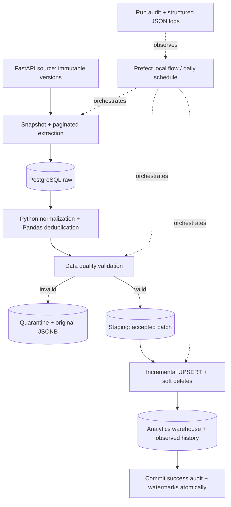

# WorkforceSync

A production-style portfolio project simulating workforce analytics ingestion. It reads a paginated REST source, cleans records with Python and Pandas, quarantines invalid data, and incrementally maintains a PostgreSQL warehouse.

The engineering problem is keeping people, employments, and classifications consistent across daily loads without losing changes, duplicating rows, or reporting a failed load as successful.

## Architecture



**Stack:** Python 3.13, FastAPI, HTTPX, Pandas, PostgreSQL 17, Psycopg 3, Alembic, Prefect 3, pytest, Ruff, Docker Compose. Dependencies are locked in `uv.lock`. No paid orchestration service is required.

## Start locally with Docker

Prerequisite: Docker Engine/Desktop with Compose. Commands run from this repository root.

```bash
cp .env.example .env
# Edit .env and set POSTGRES_PASSWORD to a local password.
docker compose up -d --build
docker compose run --rm runner alembic upgrade head
docker compose run --rm runner workforcesync seed
docker compose run --rm runner workforcesync pipeline --full
```

On PowerShell, use `Copy-Item .env.example .env` for the first command. Credentials stay in ignored `.env`. The API binds to localhost at [localhost:8000/docs](http://localhost:8000/docs). Health can pass before migration; migrate and seed before calling data endpoints.

### Daily incremental load

```bash
docker compose run --rm runner workforcesync seed --scenario incremental
docker compose run --rm runner workforcesync pipeline
docker compose run --rm runner workforcesync pipeline
docker compose run --rm runner workforcesync status
```

The seed scenarios apply once per database. The second pipeline invocation demonstrates unchanged-source idempotency. `--full` replays current source records through the same guarded UPSERT path; it does not truncate analytics or infer hard deletes.

### Tests and lint

```bash
docker compose run --rm runner python scripts/prepare_test_database.py
docker compose run --rm -e TEST_POSTGRES_DB=workforcesync_test runner pytest -q
docker compose run --rm runner ruff check .
docker compose run --rm runner ruff format --check .
```

Integration tests reset **only the explicitly selected database ending in `_test`**. Without `TEST_POSTGRES_DB`, pytest skips database tests. CI runs them against PostgreSQL, exercises migration downgrade/upgrade, runs a real HTTP/Prefect smoke test, and builds the Docker image.

For a native Python/PostgreSQL setup, see [operations](docs/operations.md). Optional Makefile targets wrap the commands; `make test` runs the tests that do not require a database.

## Execution evidence

These counts came from local PostgreSQL and HTTP executions, not canned console output. The initial run used Prefect; the incremental and unchanged runs used the same pipeline through `--direct`.

| Run | Extracted | Inserted | Updated | Soft deleted | Rejected |
|---|---:|---:|---:|---:|---:|
| Initial | 12 | 6 | 0 | 0 | 6 |
| Incremental | 5 | 2 | 2 | 1 | 0 |
| Unchanged | 0 | 0 | 0 | 0 | 0 |

[Recorded run evidence](docs/examples/runs.json) includes actual run IDs, timestamps, and per-entity metrics. Your command output is generated from audit tables and will have new IDs/timestamps. These tiny fixtures demonstrate correctness, not throughput.

## Configuration

| Variable | Default / purpose |
|---|---|
| `POSTGRES_HOST`, `POSTGRES_PORT` | `localhost`, `5432`; Compose overrides host to `db` |
| `POSTGRES_DB`, `POSTGRES_USER` | `workforcesync` |
| `POSTGRES_PASSWORD` | Required; never logged |
| `SOURCE_API_URL` | `http://localhost:8000`; Compose runner uses `http://api:8000` |
| `PAGE_SIZE` | 100; source maximum 1,000 |
| `BATCH_SIZE` | 500; maximum 2,000 to stay below SQL parameter limits |
| `MAX_REJECTED_FRACTION` | 1.0; set 0 for strict all-valid acceptance |
| `LOG_LEVEL` | `INFO` |
| `PREFECT_API_URL` | Optional self-hosted server; omitted uses local ephemeral server |
| `TEST_POSTGRES_DB` | Explicit isolated test database ending in `_test` |

Settings validate configuration using environment variables and optional `.env`. Prefect settings are its own environment variables. See `.env.example`.

## Data model and load guarantees

`source.change` stores immutable versions of simulated source records. `raw.person`, `raw.employment`, and `raw.classification` retain original JSONB by run. Typed `staging` tables hold the last committed accepted batch. `analytics.dim_person`, `analytics.dim_classification`, and `analytics.fact_employment` hold the current warehouse state. `analytics.employment_history` records employment versions observed by successful loads.

Each run obtains a source snapshot and a timestamp boundary. Per-entity PostgreSQL watermarks bound the next extraction. Source writes and snapshot creation share a short lock, preventing an in-flight old timestamp from slipping behind the watermark. Pagination reads immutable versions within the snapshot. Timestamp lower bounds are inclusive; timestamp-guarded `ON CONFLICT DO UPDATE` makes replay safe.

Warehouse changes, staging replacement, success audit, and all watermarks commit together. Raw and quarantine evidence commit separately, so load failures remain diagnosable. A single-writer advisory lock prevents overlapping pipeline runs. [CDC details and limitations](docs/cdc-and-idempotency.md).

## Data quality, failures, and observability

Validation covers required values, blank/sentinel normalization, duplicate business keys, basic email syntax, allowed statuses/types, ISO dates, date ranges, timezone-aware timestamps, and foreign-key references. Rejections include the original payload and a machine-readable reason. The default quarantines individual bad rows and continues; the configured rejection threshold can fail the whole load.

Run `workforcesync pipeline --fail-at extraction`, `--fail-at validation`, or `--fail-at load` to exercise controlled failures. The command exits nonzero, records `FAILED`, and leaves successful watermarks and analytics unchanged. Run again without the flag to recover. [Exact scenarios and inspection queries](docs/operations.md).

Structured logs carry run, entity, stage, and counts. Audit tables record actual counts and duration. If PostgreSQL itself is unreachable, persisting an audit row is impossible; logs remain the fallback. A process kill can leave `RUNNING` and requires operator reconciliation. [Troubleshooting](docs/troubleshooting.md).

## Analytics and performance

```bash
docker compose run --rm runner python scripts/run_analytics.py
```

Six queries cover department headcount, active classifications, monthly starts, status distribution, department ranking, and observed classification changes. They demonstrate INNER/LEFT JOIN, CASE, aggregation, CTEs, and window functions with defined counting semantics.

Loads use bounded multi-row UPSERTs and pipelined raw inserts. Business keys, join keys, and timestamps have indexes. Pandas provides deterministic deduplication for this small, in-memory workload. At larger scale, stream extraction into raw storage, deduplicate in SQL, use COPY and keyset pagination, and introduce retention. [Performance decisions and EXPLAIN](docs/performance.md).

## Repository map and handoff

| Location | Responsibility |
|---|---|
| `api/` | Versioned REST endpoints and stable pagination |
| `src/workforcesync/` | Configuration, extraction, transformations, validation, loading, audit, CLI |
| `orchestration/` | Prefect stages, transient network retries, daily serving entrypoint |
| `migrations/` | Reversible PostgreSQL schema migration |
| `tests/unit`, `tests/data_quality`, `tests/integration` | Behavioral tests |
| `sql/analytics`, `scripts/` | Read-only analysis and local operations |
| `docs/` | [Architecture](docs/architecture.md), [model](docs/data-model.md), [lineage](docs/data-lineage.md), [quality](docs/data-quality.md), [requirement coverage](docs/requirement-coverage.md) |

## Screenshots

No illustrative screenshots are presented as execution proof. Open the running API's `/docs` for the actual endpoint UI, or run a local Prefect server for the execution UI. Machine-readable run evidence is included above.

## Limitations and next improvements

This is polling CDC, not WAL-based replication. Source tombstones must retain full record fields. Multiple changes between snapshots collapse to the latest state, so observed history is not a complete event ledger. Deleted parents remain for historical foreign keys; current headcount queries exclude them. Quarantined records need a source correction with a fresh timestamp or a full replay after changing validation rules.

The local simulator shares a PostgreSQL instance with the warehouse, has no authentication, and contains only synthetic data. It is intended for local review. There is no automatic retention, source-clock rollback recovery, or crash-reconciliation daemon. Docker was unavailable on the development host; native PostgreSQL 17 and HTTP/Prefect execution were tested, while the included CI performs the container checks. See [verification](docs/verification.md) for the precise validation record.
